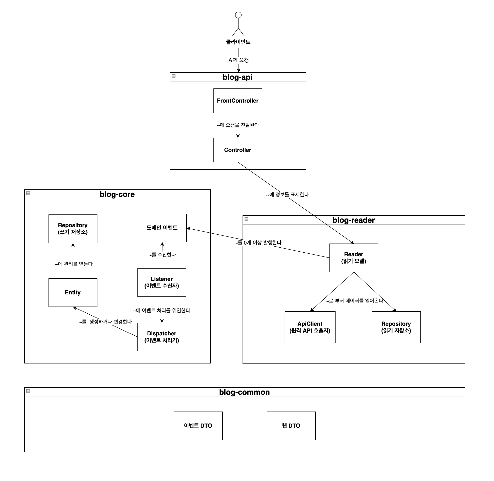

## 지원자 정보
126-000119_이기수_서버 개발자서버 개발자 (HIGHLIGHT 채용) 

## 구현한 기능
- 키워드 블로그 검색 (정확도순, 최신순) 페이징 조회
  - 카카오 API, 네이버 API 연동 및 fallback 구현
- 인기 검색어 목록 조회
- 멀티 모듈 구성 및 Spring ApplicationEvent를 이용한 느슨한 결합
- 키워드 별 검색 횟수 저장 시, 동시성 이슈 해결

## 기술 스택
- 언어: Java 11
- 프레임워크 : Spring Boot 2
- 데이터베이스 : H2 (MySQL)
- 빌드 도구 : Gradle

## 프로젝트 구조
멀티 모듈 프로젝트로, 이벤트 기반의 CQRS 패턴을 적용하여 읽기 모델과 쓰기 모델을 분리하였습니다.

- `blog-api` 모듈
  - 키워드 검색, 인기 검색어 조회 API 앤드포인트 및 인터페이스를 정의합니다.
  - `blog-reader` 모듈의 읽기 모델을 이용해 API 응답값을 반환합니다.
- `blog-reader` 모듈
    - 키워드 검색, 인기 검색어 조회에 대한 읽기 모델을 정의하고 구현합니다.
    - 키워드 검색 시, 키워드가 검색되었다는 이벤트를 발행합니다.
- `blog-core` 모듈
    - 키워드가 검색되었다는 이벤트를 수신합니다.
    - 이벤트를 수신하면, 조회수를 증가시키는 등의 도메인 로직을 수행합니다.
- `blog-common` 모듈
  - 공통 모듈로 각종 DTO 객체를 정의합니다.

## 모듈별 컴포넌트 및 상호작용 다이어그램
각 모듈간의 호출은 같은 JVM 위에서 이루어지지만, 약간의 코드 작업으로 메시지 큐와 원격 호출로 대체할 수 있도록 느슨한 결합을 가지도록 설계하였습니다.



클라이언트가 서비스 API 호출 시, 발생되는 플로우
1. `blog-api` 클라이언트 요청을 처리하기 위해 적절한 읽기 모델을 호출합니다.
2. `blog-reader` 호출된 읽기 모델은 외부 API 또는 Repository 를 통해 응답 데이터를 반환합니다.
3. `blog-reader` 읽기 모델에 호출이 발생하면 해당하는 도메인 이벤트를 발행합니다.
4. `blog-core` 도메인 이벤트를 수신하고, 이벤트 디스패처에 처리를 위임합니다.


## 외부 라이브러리 의존성
- spring-boot-starter-web : 서블릿 API 기반 클라이언트 요청 처리를 위해 
- spring-boot-starter-validation : DTO 유효성 검증 수행
- spring-boot-starter-data-jpa : 객체 중심 모델링 및 생산성 향상
- spring-cloud-starter-openfeign : 외부 API 연동을 어노테이션 기반으로 반복적인 코드를 줄일 수 있습니다
- jackson-databind : spring-boot-starter-web 모듈에 의존성을 가지지 않는 모듈에서 사용
- spring-retry : DB 중복키 오류 발생 시, 재시도하기 위해 사용


## 주요 기능 구현
**1. 블로그 검색**
- 카카오 API, 네이버 API 연동은 OpenFeign 라이브러리를 사용했습니다.
- OpenFeign 은 선언전 REST 클라이언트로, REST API 연동에 필요한 반복적인 코드를 줄일 수 있습니다.
- 카카오 API, 네이버 API는 `BlogDocumentClient` 라는 인터페이스로 추상화하였습니다.
- 추상화한 이유는 구현체`(카카오, 네이버)`의 응답값이나 요청 파라미터와 의존성을 분리하고, fallback 구현 시 공통 인터페이스가 필요했기 때문입니다.


**2. 인기 검색어 목록**
- 인기 김색어 목록을 구현하기 위해, 키워드별 검색횟수를 저장할 수 있는 테이블을 설계하였습니다.
```sql
create table KEYWORD_ANALYTICS
(
    id           bigint       NOT NULL AUTO_INCREMENT,
    keyword      varchar(255) not null,
    search_count bigint       not null,
    create_at    datetime(3) not null,
    primary key (id)
);
```
- 시스템에서 해당 테이블에 조회가 필요한 경우는 다음 2가지 입니다.
  - 키워드에 검색횟수를 증가시키기 위해 keyword 필드로 테이블을 조회
  - 인기 검색어 Top N개를 추출하기 위해 검색횟수 내림차순 정렬 조회
- 위의 두 가지 케이스를 고려해, 아래와 같은 인덱스를 구성하면 효율적으로 DB를 엑세스 할 수 있습니다.

```SQL
create unique index UIX01_KEYWORD_ANALYTICS
    on KEYWORD_ANALYTICS (keyword);

create index IX01_KEYWORD_ANALYTICS
    on KEYWORD_ANALYTICS (search_count, id);
```

**3. 멀티 모듈 설계**
- 모듈 설계 전, 주어진 요구사항에서 핵심 도메인은 무엇이며 변하는 것과 변하지 않는 것은 무엇인지 고민하였습니다.
- 제가 분석한 요구사항의 핵심 도메인은 **키워드 분석 도메인** 입니다.
- 키워드 분석 도메인은 검색 API의 구현과 관계없이 키워드를 분석할 수 있어야 합니다.
- 키워드 분석 모델의 상태를 변경시 킬 수 있는 것은 키워드가 검색되었다는 이벤트 뿐 입니다.
- 이러한 이유로 키워드 분석 도메인은 core 모듈로 설계하였고, 이벤트를 수신/발신하는 채널은 Spring ApplicationEvent를 사용했습니다.
- 그래서 최종적으로 이벤트 드리븐 기반 CQRS 패턴의 모듈 설계가 되었습니다.
  - `api`,`reader`,`core`,`common` 모듈

**4. 트래픽 및 동시성 이슈 처리**

트래픽 관리
- 읽기 모델과 쓰기 모델이 이벤트로 통신하기 때문에, 서버 분리가 가능합니다.
- 읽기 트래픽 많으면 읽기 모델 서버만 스케일 아웃할 수 있습니다.
- 쓰기 모델은 이벤트 기반 비동기 처리가 가능해, 쓰기 지연이 발생하더라도 읽기 모델에 영향을 주지 않습니다.

동시성 이슈 관리
- JPA를 사용하여 엔티티를 업데이트 하기 위해서는 일반적으로 `SELECT`, `UPDATE` 두 번의 SQL이 호출되기 때문에 갱신손실 문제와 같은 동시성 이슈가 발생할 수 있습니다.
- 가장 쉬운 해결 방법은 검색 횟수 업데이트 트랜잭션을 원자적 연산으로 처리하는 것 입니다.

`UPDATE keyword_analytics SET search_count = search_count + 1 WHERE keyword = 'xx';`
- 하지만, 이러한 방식은 객체 중심적이지 않고 새로운 키워드를 저장하는 경우에는 저장된 데이터가 있는지 확인하는 작업이 들어가`SELECT`, `INSERT` 두 번의 호출이 필요합니다.
- 이 문제를 해결하기 위해서는 검색 횟수 업데이트 트랜잭션에서 `SELECT FOR UPDATE` 문을 사용하여 읽기 및 쓰기 잠금을 사용하여 동시성 문제를 회피할 수 있습니다.


## 테스트 코드
각 모듈의 관심사별로 테스트 코드를 작성하였습니다.

- **api 모듈 테스트 케이스**


- **reader 모듈 테스트 케이스**


- **core 모듈 테스트 케이스**
